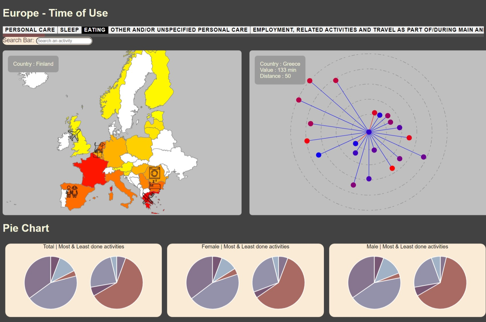

# Data Visualization Project

## Overview
The dataset in question studies the time people spend on different activities according to their nationality and gender.
The data comes from the Eurostat organization.

Thanks to its visualization, users can determine which countries spend the most time on a given activity,
find out how countries distribute their time, and discover whether nearby countries have similar behaviors.

The visualization is done on a webpage thanks to [D3.js](https://d3js.org/).

|  |
| *Visualization of the time spent on the activity "eating", with a focus on "Finland"* |

## Setup instructions
* First, a local server needs to be set up. This can be easily done in Visual Studio Code thanks to the extension [Live Server](https://marketplace.visualstudio.com/items?itemName=ritwickdey.LiveServer) for instance.
* Once the server is set up, the visualization can be found on the webpage, ```index.html```.
